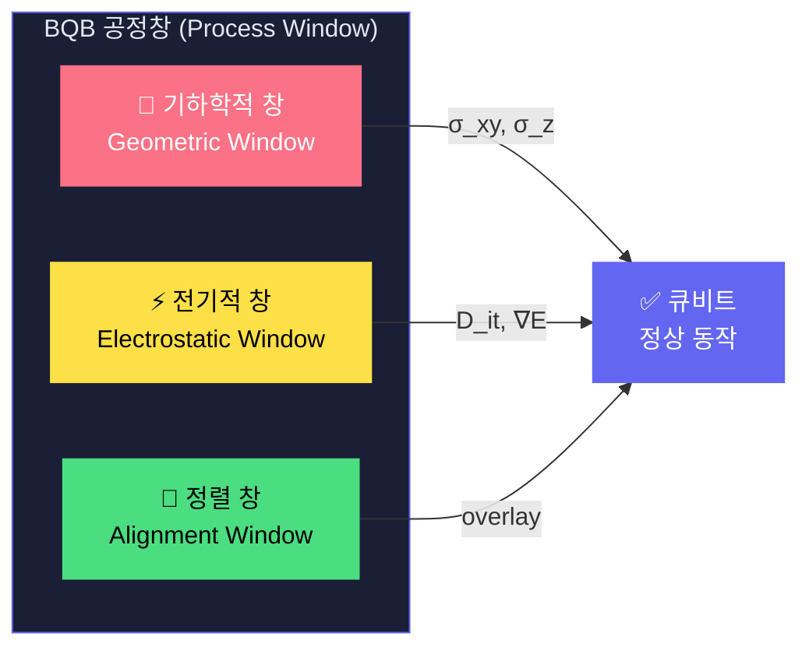
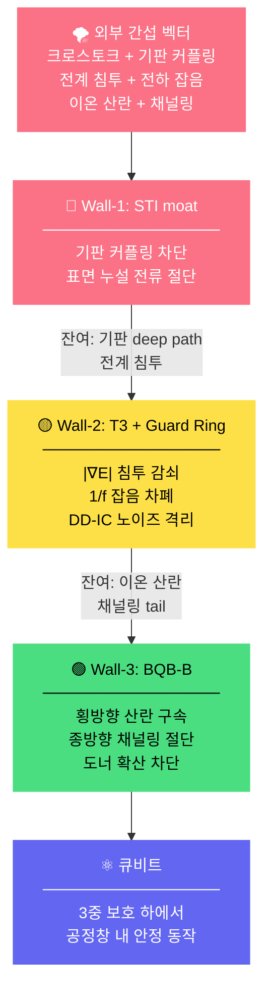
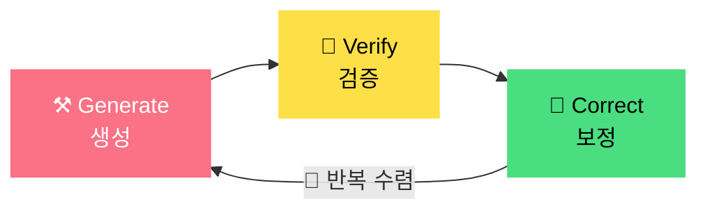
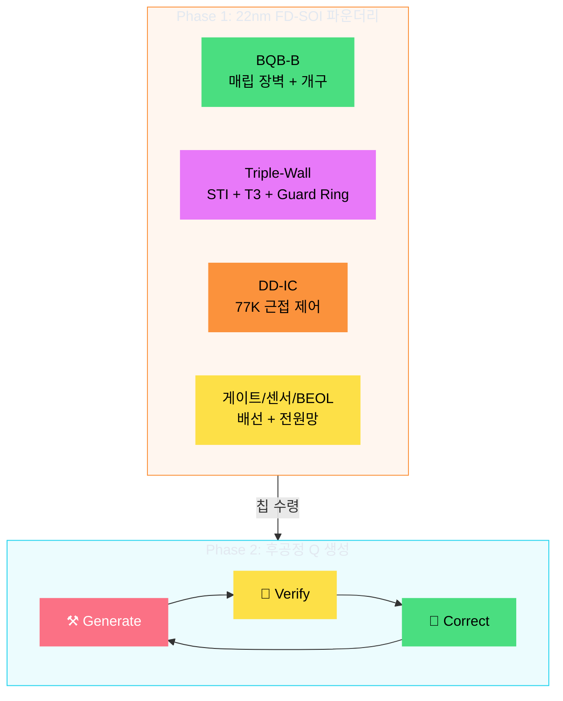
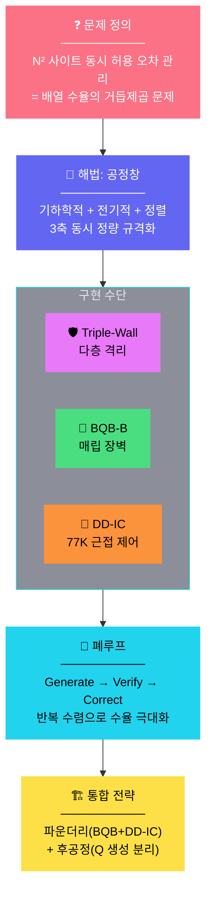

<div align="center">

<!-- Quantum Wave Header -->


<!-- Animated Typing -->


<br/>

<!-- Badges -->


<br/>


</div>

> **이 문서는 BQB의 물리적 메커니즘과 설계 원리를 정량적으로 설명합니다.**
>
> 전제: 큐비트의 기본 개념(스핀, 중첩, 결맞음)을 이해하고 있으며, 반도체 공정의 기초(이온 주입, 포토리소그래피, 에칭)에 대한 배경지식이 있는 독자를 대상으로 합니다.


## 📑 목차

<div align="center">

| # | 주제 | 핵심 원리 |
|:---:|------|----------|
| 1 | [이온 주입의 산란 물리](#1--이온-주입의-산란-물리) | straggle, channeling, 확률적 분포의 배열 수율 영향 |
| 2 | [공정창 정량 규격](#2--공정창process-window-정량-규격) | 기하학적/전기적/정렬 창의 동시 정의와 물리적 강제 |
| 3 | [Triple-Wall 다층 격리 물리](#3--triple-wall-다층-격리-물리) | STI / T3 / BQB-B 각 벽의 독립적 메커니즘과 직렬 감쇠 |
| 4 | [수율의 정량적 논리](#4--수율의-정량적-논리) | 개별 수율 → 배열 수율의 거듭제곱 관계 |
| 5 | [폐루프 공정 체계](#5--폐루프-공정-체계) | Generate → Verify → Correct 의 반복 수렴 |
| 6 | [공정 분리형 통합 전략](#6--공정-분리형-통합-전략) | 파운더리 + 후공정 분리의 구조적 필연성 |

</div>

---


## 1. ⚛️ 이온 주입의 산란 물리

### 1.1 단일 이온의 감속 메커니즘

가속된 ³¹P⁺ 이온이 Si 격자에 진입하면 두 가지 감속 메커니즘을 겪습니다:

<div align="center">

```
³¹P⁺ 이온 (keV 에너지)
    │
    ├─── 핵 충돌 (Nuclear Stopping, Sₙ)
    │    └─ Si 핵과의 탄성 충돌 → 큰 각도 편향
    │       → 횡방향 산란(lateral straggle)의 주 원인
    │
    └─── 전자 제동 (Electronic Stopping, Sₑ)
         └─ 전자 구름과의 비탄성 상호작용 → 연속적 감속
            → 종방향 침투 깊이 결정
```

</div>

### 1.2 확률적 분포: straggle과 channeling

동일 에너지·동일 각도로 주입해도 최종 정지 위치는 **통계적 분포**를 따릅니다:

<div align="center">

| 분포 유형 | 물리적 원인 | 특성 | 위험도 |
|-----------|-----------|------|:------:|
| **횡방향 산란 (σ_xy)** | 핵 충돌에 의한 무작위 방향 전환 | 가우시안 분포, keV급에서 수~수십 nm | 🟡 |
| **종방향 산란 (σ_z)** | 에너지 손실률의 통계적 변동 | 가우시안 분포, 주입 에너지에 비례 | 🟡 |
| **채널링 tail** | 결정 축과 이온 입사 방향 정렬 시 격자 채널 관통 | **비가우시안** — 수백 nm 깊이까지 지수적 감쇠 | 🔴 |

</div>

### 1.3 단일 큐비트 vs 배열: 왜 확률적 접근이 무너지는가

단일 큐비트 제작에서는 **후선별(post-selection)** 이 가능합니다 — 수십 개를 만들고 가장 좋은 것을 골라 쓸 수 있습니다.

그러나 **배열에서는 모든 사이트가 동시에 공정창 안에 들어와야** 합니다:

<div align="center">

```
단일 큐비트: 100개 중 1개만 OK면 성공  → 후선별 가능

N×N 배열:   N² 개 전부가 OK여야 성공  → 후선별 불가능

                                   ┌─────────────────────────┐
사이트 수율 p = 0.95일 때:           │ 배열 수율 = p^(N²)       │
                                   │                         │
  4×4  (16개):  0.95¹⁶  = 44%     │  아직 가능               │
  8×8  (64개):  0.95⁶⁴  = 3.7%    │  사실상 불가능            │
  16×16(256개): 0.95²⁵⁶ = 0.0002% │  완전 불가능              │
                                   └─────────────────────────┘
```

</div>

> [!IMPORTANT]
> **이것이 BQB가 풀어야 하는 문제의 본질입니다.**
> 개별 큐비트 성능이 아니라, **N² 사이트의 동시 허용 오차 관리**가 확장의 병목입니다.

---


## 2. 📐 공정창(Process Window) 정량 규격

### 2.1 공정창의 정의

BQB 공정창은 **큐비트가 정상 동작하기 위한 다차원 허용 오차 공간의 정량적 정의**입니다.

세 가지 독립 축으로 구성되며, 이들은 **동시에** 만족되어야 합니다:



### 2.2 기하학적 창 (Geometric Window)

<div align="center">

| 파라미터 | 정의 | 물리적 의미 | 목표값 |
|---------|------|-----------|-------|
| **σ_xy** | 횡방향 위치 분산 | 이온의 좌우 산란 범위 | ≤ 20→10 nm (연차별) |
| **σ_z** | 종방향 위치 분산 | 이온의 깊이 산란 범위 | ≤ 10→5 nm (연차별) |
| **개구 CD** | BQB 템플릿 개구 폭 | 이온 주입 허용 영역 | 40~120 nm |
| **장벽 깊이** | BQB-B 매립 깊이 | 채널링 tail 절단 깊이 | 80~300 nm |

</div>

**물리적 강제 메커니즘:**
- BQB 개구(aperture)가 **횡방향 산란을 구속**: 개구 밖으로 흩어진 이온은 장벽에 의해 비활성화
- BQB-B 매립 장벽이 **종방향 채널링 tail을 절단**: 장벽 깊이가 침투 상한을 물리적으로 설정
- 두 가지 결합으로 **유효 3D 포획 체적(effective capture volume)** 을 정의

### 2.3 전기적 창 (Electrostatic Window)

<div align="center">

| 파라미터 | 정의 | 물리적 의미 | 목표값 |
|---------|------|-----------|-------|
| **D_it** | 계면 트랩 밀도 | 게이트-Si 계면 결함 → 큐비트 주파수 변동 | ≤ 10¹⁰ cm⁻²eV⁻¹ |
| **Q_f** | 고정 전하 밀도 | 산화막 내 갇힌 전하 → 전계 환경 왜곡 | ≤ 5 × 10¹⁰ cm⁻² |
| **\|∇E\|** | 국부 전계 기울기 | 큐비트 근방 전기장 불균일 → valley splitting 변동 | ~ 1-10 kV/cm |
| **S_Q(1Hz)** | 1/f 전하 잡음 | 저주파 전하 요동 → 결맞음 시간 감소 | ≈ 10⁻³ e/√Hz |

</div>

**물리적 강제 메커니즘:**
- BQB 패시베이션 공정이 **D_it, Q_f를 동시 억제**
- Triple-Wall의 T3 guard ring이 **|∇E| 침투와 1/f 잡음을 차폐**

### 2.4 정렬 창 (Alignment Window)

<div align="center">

| 파라미터 | 정의 | 물리적 의미 | 목표값 |
|---------|------|-----------|-------|
| **Q-게이트 overlay** | 큐비트 ↔ 제어 게이트 정렬 오차 | 게이트 전압 인가 위치 정확도 | ≤ 15 nm |
| **Q-패키징 overlay** | 큐비트 ↔ DD-IC 패키지 정렬 오차 | 근접 제어 신호 전달 정확도 | ≤ 30 nm |
| **검증 지표** | ΔR/R, 누설전류, 열 사이클 | 정렬 오차의 전기적 영향 정량화 | 실측 기반 |

</div>

> [!WARNING]
> **세 가지 창이 동시에 충족되지 않으면 배열 확장은 구조적으로 불가능합니다.**
>
> 기하학적으로 정확해도 전기 환경이 불안정하면 큐비트가 동작하지 않고,
> 전기 환경이 안정적이어도 정렬이 어긋나면 제어가 불가능합니다.

---


## 3. 🛡️ Triple-Wall 다층 격리 물리

Triple-Wall은 **상이한 물리적 메커니즘**으로 동작하는 세 겹의 격리층입니다.
각 벽은 독립적 위협 벡터를 차단하며, **직렬 구조로 잔여 간섭을 단계적으로 감쇠**시킵니다.

### 3.1 구조 단면

```
       Surface
  ═══════════════════════════════════════════
  │  ┌─────────────────────────────────┐    │
  │  │ Wall-1: STI 격리 moat            │    │  ← SiO₂ 충전 트렌치
  │  │  ┌─────────────────────────┐     │    │
  │  │  │ Wall-2: T3 Triple Well   │     │    │  ← deep n-well/p-well/n-well
  │  │  │  ┌─────────────────┐     │     │    │     + quiet guard ring
  │  │  │  │ Wall-3: BQB-B    │     │     │    │  ← 매립 장벽
  │  │  │  │                  │     │     │    │     (깊이 80~300nm,
  │  │  │  │    ⚛️ Qubit      │     │     │    │      개구 40~120nm)
  │  │  │  │   (³¹P donor)    │     │     │    │
  │  │  │  └─────────────────┘     │     │    │
  │  │  └─────────────────────────┘     │    │
  │  └─────────────────────────────────┘    │
  ═══════════════════════════════════════════
       Si Substrate
```

### 3.2 각 벽의 메커니즘과 정량 지표

<details open>
<summary><b>🔴 Wall-1: STI (Shallow Trench Isolation) 격리 moat</b></summary>
<br/>

| 항목 | 상세 |
|------|------|
| **물리적 구현** | 타일 경계에 SiO₂ 충전 트렌치를 형성 |
| **차단 대상** | 인접 큐비트 간 **기판 커플링**(substrate coupling)과 **표면 누설 전류** 경로 |
| **메커니즘** | SiO₂의 높은 유전 장벽(~9eV)이 전자/정공의 이동 경로를 물리적으로 절단 |
| **정량 지표** | moat 폭/간격, 타일 pitch, 금속/비아 keep-out 설계 변수로 제어 |
| **한계** | 기판 내부의 깊은 경로(deep substrate path)는 차단 불가 → Wall-2가 보완 |

</details>

<details open>
<summary><b>🟡 Wall-2: T3 (True Triple Well) + Quiet Guard Ring</b></summary>
<br/>

| 항목 | 상세 |
|------|------|
| **물리적 구현** | deep n-well / p-well / n-well 의 3중 우물 구조 + 외곽 quiet guard ring |
| **차단 대상** | **전계 구배 침투**(|∇E| leakage), **1/f 전하 잡음**, **DD-IC 스위칭 노이즈** |
| **메커니즘** | 3중 pn-junction이 역바이어스 공핍층을 형성하여 전기적 실드 생성. guard ring이 잔여 전계 침투를 추가 감쇠 |
| **정량 지표** | \|∇E\| < 10 kV/cm, S_Q(1Hz) < 10⁻³ e/√Hz |
| **핵심 효과** | 각 큐비트의 **back-gate와 웰 도메인을 전기적으로 독립 분리** → 개별 미세 조정 가능 |

</details>

<details open>
<summary><b>🟢 Wall-3: BQB-B (Buried Quantum Barrier)</b></summary>
<br/>

| 항목 | 상세 |
|------|------|
| **물리적 구현** | Si 기판 내부의 고농도 도핑/산화 장벽 (깊이 80~300nm, 개구 CD 40~120nm) |
| **차단 대상** | **이온 산란**(straggle), **채널링 tail**, **도너 확산** |
| **메커니즘** | 개구가 횡방향 산란을 구속, 장벽 깊이가 종방향 채널링을 절단. 동시에 어닐 시 도너 열확산도 차단 |
| **정량 지표** | 장벽 깊이 80~300 nm, 개구 CD 40~120 nm (설계 변수로 조정). σ_xy/σ_z 공정창 강제 |
| **핵심 효과** | **기하학적 공정창을 물리적으로 강제** — 주입 조건과 무관하게 유효 포획 체적이 구조에 의해 결정됨 |

</details>

### 3.3 직렬 감쇠 구조



---


## 4. 📊 수율의 정량적 논리

### 4.1 배열 수율 = 사이트 수율의 거듭제곱

배열 전체가 동작하려면 **모든 사이트가 공정창 내에 들어와야** 합니다.

<div align="center">

```
배열 수율 Y_array = (사이트 수율 p)^(N²)
```

| 사이트 수율 (p) | 4×4 (16) | 8×8 (64) | 16×16 (256) | 32×32 (1024) |
|:-:|:-:|:-:|:-:|:-:|
| **90%** | 18.5% | 0.12% | ~0% | ~0% |
| **95%** | 44.0% | 3.7% | 0.0002% | ~0% |
| **99%** | 85.1% | 52.5% | 7.6% | 0.003% |
| **99.5%** | 92.3% | 72.6% | 27.8% | 0.6% |
| **99.9%** | 98.4% | 93.8% | 77.4% | 35.8% |

</div>

### 4.2 이것이 의미하는 것

- **16×16 배열**에서 유의미한 수율(>10%)을 달성하려면 사이트 수율 **≥ 99%** 가 필요합니다
- **32×32 배열**에서는 사이트 수율 **≥ 99.9%** 가 요구됩니다
- 이는 "좋은 큐비트를 만드는 것"이 아니라 **"공정 산포를 극한까지 줄이는 것"** 이 핵심임을 의미합니다

> [!IMPORTANT]
> BQB의 공정창은 이 수율 요구를 **물리적 구조로 강제**합니다.
> 확률적 후선별이 아닌, **구조적 구속에 의한 수율 확보**가 BQB의 핵심 전략입니다.

---


## 5. 🔄 폐루프 공정 체계

### 5.1 Generate → Verify → Correct 순환

BQB 공정은 **단방향 제작이 아닌 반복 수렴 체계**입니다.



### 5.2 각 단계의 도구와 산출물

<details open>
<summary><b>⚒️ Generate (생성)</b></summary>
<br/>

| 항목 | 상세 |
|------|------|
| **입력** | BQB 템플릿 (개구 좌표 + 장벽 깊이) |
| **공정** | 단일 이온 주입 (³¹P⁺, keV급) + 저열예산 활성화 (RTA 또는 laser anneal) |
| **핵심 제약** | 열예산(thermal budget)을 엄격히 제한하여 도너 확산 최소화. BQB-B 장벽이 활성화 시 확산 차단 역할도 수행 |
| **산출물** | Q 생성 웨이퍼 (도너 위치 미확인 상태) |

</details>

<details open>
<summary><b>🔬 Verify (검증)</b></summary>
<br/>

| 항목 | 상세 |
|------|------|
| **3D 구조 분석** | nano-CT / XRD-CT로 3D 상(phase)·변형(strain) 분포 비파괴 매핑 |
| **조성 교차검증** | APT(원자단층현미경) + SIMS(이차이온질량분석) + TEM(투과전자현미경) 으로 조성 및 tail 깊이 확인 |
| **전기/광학 맵** | 웨이퍼 검사 장비로 저온 전기적·광학적 특성 맵 취득 |
| **산출물** | 3D 도너 좌표 맵 + 전하 환경 맵 + 공정창 준수 여부 판정 |

</details>

<details open>
<summary><b>🔧 Correct (보정)</b></summary>
<br/>

| 항목 | 상세 |
|------|------|
| **공정 파라미터 갱신** | 주입 에너지·각도·선량, 개구 형상, 패시베이션 조건, 어닐 파형 업데이트 |
| **DD-IC 캘리브레이션** | 실측 기반 77K DD-IC 게이트 전압 보정 테이블 업데이트 |
| **최종 산출물 4종** | ① 공정창 항목별 허용치 ② outlier 확률 및 원인 모델 ③ die-map 기반 재매핑 규칙 ④ 공정-운용 통합 보정 테이블 |

</details>

### 5.3 수렴의 정량적 의미

```
회전 1:  공정창 이탈률 ~40%  →  사이트 수율 ~60%   →  배열 수율 ≈ 0%
회전 3:  공정창 이탈률 ~10%  →  사이트 수율 ~90%   →  배열 수율 < 1%
회전 5:  공정창 이탈률 ~2%   →  사이트 수율 ~98%   →  배열 수율 ~ 1%
회전 N:  공정창 이탈률 <0.5% →  사이트 수율 ≥99.5% →  배열 수율 ≥ 28%
```

> [!TIP]
> 이것이 "공정 분리형 통합 전략"과 직결됩니다.
> Q 생성을 후공정으로 분리해야 이 반복 수렴이 **비용-효율적으로 가능**해집니다.

---


## 6. 🏗️ 공정 분리형 통합 전략

### 6.1 두 단계 분리 구조



### 6.2 파운더리에서 동시 구현하는 것

| 구성요소 | 역할 | 상세 |
|---------|------|------|
| **BQB-B** | 공정창 물리적 강제 | 매립 장벽 + 개구 템플릿 → 기하학적/전기적 창 동시 정의 |
| **Triple-Wall** | 다층 격리 | STI + T3 + guard ring → 크로스토크/잡음/산란 차단 |
| **DD-IC** | 77K 근접 제어 | Dynamic Decoupling IC → 큐비트 직접 제어 펄스 생성 |
| **BEOL** | 배선/전원 인프라 | 게이트 전극, 판독 센서, 배선망, 전원 분배 |

### 6.3 분리의 세 가지 구조적 이유

<div align="center">

| 이유 | 설명 |
|------|------|
| **오염/열예산 격리** | 이온 주입 및 활성화의 오염·열예산 리스크를 파운더리 공정으로부터 완전 분리 |
| **반복 최적화** | Q 생성을 후공정으로 분리하면 폐루프 반복이 가능 → 파운더리 비용 재지불 없이 공정창 수렴 |
| **스케일 확장** | BQB 타일 + DD-IC를 동일 PDK/DRC 룰로 검증 → 배열 면적 확대 시 레이아웃/EM/IR 리스크 최소화 |

</div>

### 6.4 DD-IC 근접 제어의 역할

77K 스테이지에 배치된 DD-IC는 다음을 수행합니다:

```
         300K (실온)                    77K (중간 스테이지)              4K (큐비트)
  ┌──────────────────┐          ┌──────────────────────┐        ┌────────────────┐
  │  외부 AWG + PLL    │          │  DD-IC (on-chip)      │        │  큐비트 배열     │
  │  (고수준 디지털     │ ──────→ │  온칩 LO-PLL/DCO      │ ─────→│  ³¹P 스핀       │
  │   명령 생성)       │  디지털   │  + 이벤트 시퀀서       │  RF   │  제어 + 판독    │
  └──────────────────┘  신호     │  → 정밀 펄스 현장 생성  │  펄스  └────────────────┘
                                │  → 스큐/지터 보정      │
                                └──────────────────────┘
```

- **근접 배치의 이유**: 300K→4K 직접 배선 시 fan-out 병목 + 열 유입 + 신호 감쇠
- **77K DD-IC**: 디지털 명령을 수신하여 큐비트에 필요한 RF 펄스를 현장에서 생성
- **Split-stage 패키징**: 300K ↔ 77K ↔ 4K 각 스테이지 간 열/신호 인터페이스를 단계적으로 관리

---


## 📋 전체 구조 요약



<div align="center">

> **BQB는 "더 좋은 큐비트"를 만드는 기술이 아닙니다.**
>
> **N² 사이트의 동시 공정창 충족이라는 정량적 요구를,**
> **물리적 구조와 반복 수렴 체계로 강제하는 프레임워크입니다.**

</div>

---


## 🔤 용어 참조 (중급)

<details>
<summary><b>📖 클릭하여 펼치기</b></summary>
<br/>

| 용어 | 정의 | 물리적 맥락 |
|------|------|-----------|
| **Straggle (σ)** | 이온 주입 시 최종 정지 위치의 통계적 분산 | 핵 충돌의 무작위성에 기인. 횡방향(σ_xy)과 종방향(σ_z) 분리 정의 |
| **Channeling** | 결정 축 방향으로 이온이 격자 채널을 따라 비정상적으로 깊이 침투하는 현상 | 비가우시안 tail을 형성하여 공정창 이탈의 주요 원인 |
| **D_it** | 계면 트랩 밀도 (interface trap density) | Si-SiO₂ 계면의 결함 상태. 큐비트 주파수를 무작위로 변동시킴 |
| **Q_f** | 고정 전하 밀도 (fixed oxide charge) | 산화막 내 갇힌 전하. 국부 전계 환경을 왜곡 |
| **\|∇E\|** | 국부 전계 기울기 | 큐비트 근방의 전기장 불균일도. valley splitting 변동과 직결 |
| **STI** | Shallow Trench Isolation | SiO₂ 충전 트렌치로 인접 소자를 물리적 격리 |
| **T3** | True Triple Well | deep n-well/p-well/n-well 3중 우물. 역바이어스 pn-junction으로 전기적 실드 |
| **BQB-B** | Buried Quantum Barrier - Barrier | Si 내부 매립 장벽. 이온 침투 깊이 제한 + 개구로 횡방향 구속 |
| **DD-IC** | Dynamic Decoupling Integrated Circuit | 77K에서 동작하는 큐비트 제어 펄스 생성 회로 |
| **FD-SOI** | Fully Depleted Silicon-On-Insulator | 22nm 급 상용 반도체 공정 플랫폼. BOX(매립 산화막) 위에 완전 공핍 채널 |
| **Overlay** | 다층 리소그래피 간 정렬 오차 | 큐비트 좌표계 ↔ 배선/패키징 좌표계 간 누적 오차 |
| **RTA** | Rapid Thermal Anneal | 초단시간 고온 처리. 도너 활성화를 하되 확산을 최소화 |
| **APT** | Atom Probe Tomography (원자단층현미경) | 3D 원자 위치를 직접 매핑하는 분석 기법 |
| **SIMS** | Secondary Ion Mass Spectrometry | 깊이 방향 조성 프로파일 측정 |

</details>

---

## 🗺️ 난이도 맵

<div align="center">

```
초급 (Beginner)          ← 이전 가이드: 비유 중심, 사전 지식 불요
━━━━━━━━━━━━━━━━━━━━━━━━━━━━━━━━━━━━
중급 (Intermediate)      ← 현재 가이드: 물리 메커니즘, 정량 규격, 설계 원리
━━━━━━━━━━━━━━━━━━━━━━━━━━━━━━━━━━━━
고급 (Advanced)          → 다음: TCAD 시뮬레이션, 공정 레시피, DD-IC 회로 설계
```

</div>

---

<!-- Footer -->
<div align="center">


<br/>


<br/>

*이 문서는 BQB 기술의 물리적 메커니즘과 설계 원리를 중급 수준으로 설명합니다.*
*정확한 기술 사양은 제안서 원문을 참조하시기 바랍니다.*

<br/>


</div>
