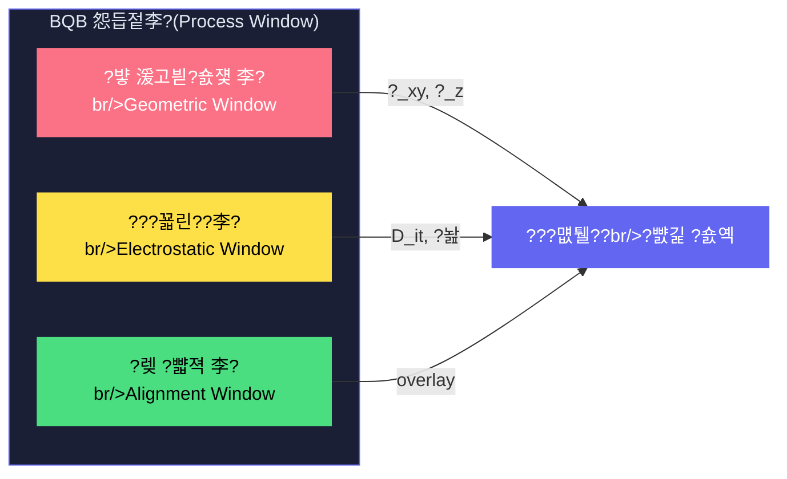

<div align="center">

<!-- Quantum Wave Header -->


<!-- Animated Topic Lines -->


<br/>

<!-- Badges -->


<br/>


</div>

> **??臾몄꽌??BQB??臾쇰━??硫붿빱?덉쬁怨??ㅺ퀎 ?먮━瑜??뺣웾?곸쑝濡??ㅻ챸?⑸땲??**
>
> ?꾩젣: ?먮퉬?몄쓽 湲곕낯 媛쒕뀗(?ㅽ?, 以묒꺽, 寃곕쭪?????댄빐?섍퀬 ?덉쑝硫? 諛섎룄泥?怨듭젙??湲곗큹(?댁삩 二쇱엯, ?ы넗由ъ냼洹몃옒?? ?먯묶)???€??諛곌꼍吏€?앹씠 ?덈뒗 ?낆옄瑜??€?곸쑝濡??⑸땲??


## ?뱫 紐⑹감

<div align="center">

| # | 二쇱젣 | ?듭떖 ?먮━ |
|:---:|------|----------|
| 1 | [?댁삩 二쇱엯???곕? 臾쇰━](#1--?댁삩-二쇱엯???곕?-臾쇰━) | straggle, channeling, ?뺣쪧??遺꾪룷??諛곗뿴 ?섏쑉 ?곹뼢 |
| 2 | [怨듭젙李??뺣웾 洹쒓꺽](#2--怨듭젙李퐌rocess-window-?뺣웾-洹쒓꺽) | 湲고븯?숈쟻/?꾧린???뺣젹 李쎌쓽 ?숈떆 ?뺤쓽?€ 臾쇰━??媛뺤젣 |
| 3 | [Triple-Wall ?ㅼ링 寃⑸━ 臾쇰━](#3--triple-wall-?ㅼ링-寃⑸━-臾쇰━) | STI / T3 / BQB-B 媛?踰쎌쓽 ?낅┰??硫붿빱?덉쬁怨?吏곷젹 媛먯뇿 |
| 4 | [?섏쑉???뺣웾???쇰━](#4--?섏쑉???뺣웾???쇰━) | 媛쒕퀎 ?섏쑉 ??諛곗뿴 ?섏쑉??嫄곕벊?쒓낢 愿€怨?|
| 5 | [?먮（??怨듭젙 泥닿퀎](#5--?먮（??怨듭젙-泥닿퀎) | Generate ??Verify ??Correct ??諛섎났 ?섎졃 |
| 6 | [怨듭젙 遺꾨━???듯빀 ?꾨왂](#6--怨듭젙-遺꾨━???듯빀-?꾨왂) | ?뚯슫?붾━ + ?꾧났??遺꾨━??援ъ“???꾩뿰??|

</div>

---


## 1. ?쏉툘 ?댁삩 二쇱엯???곕? 臾쇰━

### 1.1 ?⑥씪 ?댁삩??媛먯냽 硫붿빱?덉쬁

媛€?띾맂 쨀쨔P???댁삩??Si 寃⑹옄??吏꾩엯?섎㈃ ??媛€吏€ 媛먯냽 硫붿빱?덉쬁??寃れ뒿?덈떎:

<div align="center">

```
쨀쨔P???댁삩 (keV ?먮꼫吏€)
    ??
    ?쒋??€?€ ??異⑸룎 (Nuclear Stopping, S??
    ??   ?붴? Si ?듦낵???꾩꽦 異⑸룎 ????媛곷룄 ?명뼢
    ??      ???〓갑???곕?(lateral straggle)??二??먯씤
    ??
    ?붴??€?€ ?꾩옄 ?쒕룞 (Electronic Stopping, S??
         ?붴? ?꾩옄 援щ쫫怨쇱쓽 鍮꾪깂???곹샇?묒슜 ???곗냽??媛먯냽
            ??醫낅갑??移⑦닾 源딆씠 寃곗젙
```

</div>

### 1.2 ?뺣쪧??遺꾪룷: straggle怨?channeling

?숈씪 ?먮꼫吏€쨌?숈씪 媛곷룄濡?二쇱엯?대룄 理쒖쥌 ?뺤? ?꾩튂??**?듦퀎??遺꾪룷**瑜??곕쫭?덈떎:

<div align="center">

| 遺꾪룷 ?좏삎 | 臾쇰━???먯씤 | ?뱀꽦 | ?꾪뿕??|
|-----------|-----------|------|:------:|
| **?〓갑???곕? (?_xy)** | ??異⑸룎???섑븳 臾댁옉??諛⑺뼢 ?꾪솚 | 媛€?곗떆??遺꾪룷, keV湲됱뿉?????섏떗 nm | ?윞 |
| **醫낅갑???곕? (?_z)** | ?먮꼫吏€ ?먯떎瑜좎쓽 ?듦퀎??蹂€??| 媛€?곗떆??遺꾪룷, 二쇱엯 ?먮꼫吏€??鍮꾨? | ?윞 |
| **梨꾨꼸留?tail** | 寃곗젙 異뺢낵 ?댁삩 ?낆궗 諛⑺뼢 ?뺣젹 ??寃⑹옄 梨꾨꼸 愿€??| **鍮꾧??곗떆??* ???섎갚 nm 源딆씠源뚯? 吏€?섏쟻 媛먯뇿 | ?뵶 |

</div>

### 1.3 ?⑥씪 ?먮퉬??vs 諛곗뿴: ???뺣쪧???묎렐??臾대꼫吏€?붽?

?⑥씪 ?먮퉬???쒖옉?먯꽌??**?꾩꽑蹂?post-selection)** ??媛€?ν빀?덈떎 ???섏떗 媛쒕? 留뚮뱾怨?媛€??醫뗭? 寃껋쓣 怨⑤씪 ?????덉뒿?덈떎.

洹몃윭??**諛곗뿴?먯꽌??紐⑤뱺 ?ъ씠?멸? ?숈떆??怨듭젙李??덉뿉 ?ㅼ뼱?€??* ?⑸땲??

<div align="center">

```
?⑥씪 ?먮퉬?? 100媛?以?1媛쒕쭔 OK硫??깃났  ???꾩꽑蹂?媛€??

N횞N 諛곗뿴:   N짼 媛??꾨?媛€ OK?ъ빞 ?깃났  ???꾩꽑蹂?遺덇???

                                   ?뚢??€?€?€?€?€?€?€?€?€?€?€?€?€?€?€?€?€?€?€?€?€?€?€?€??
?ъ씠???섏쑉 p = 0.95????           ??諛곗뿴 ?섏쑉 = p^(N짼)       ??
                                   ??                        ??
  4횞4  (16媛?:  0.95쨔?? = 44%     ?? ?꾩쭅 媛€??              ??
  8횞8  (64媛?:  0.95?뜯겢  = 3.7%    ?? ?ъ떎??遺덇???           ??
  16횞16(256媛?: 0.95짼?듈겤 = 0.0002% ?? ?꾩쟾 遺덇???             ??
                                   ?붴??€?€?€?€?€?€?€?€?€?€?€?€?€?€?€?€?€?€?€?€?€?€?€?€??
```

</div>

> [!IMPORTANT]
> **?닿쾬??BQB媛€ ?€?댁빞 ?섎뒗 臾몄젣??蹂몄쭏?낅땲??**
> 媛쒕퀎 ?먮퉬???깅뒫???꾨땲?? **N짼 ?ъ씠?몄쓽 ?숈떆 ?덉슜 ?ㅼ감 愿€由?*媛€ ?뺤옣??蹂묐ぉ?낅땲??

---


## 2. ?뱪 怨듭젙李?Process Window) ?뺣웾 洹쒓꺽

### 2.1 怨듭젙李쎌쓽 ?뺤쓽

BQB 怨듭젙李쎌? **?먮퉬?멸? ?뺤긽 ?숈옉?섍린 ?꾪븳 ?ㅼ감???덉슜 ?ㅼ감 怨듦컙???뺣웾???뺤쓽**?낅땲??

??媛€吏€ ?낅┰ 異뺤쑝濡?援ъ꽦?섎ʼn, ?대뱾?€ **?숈떆??* 留뚯”?섏뼱???⑸땲??



### 2.2 湲고븯?숈쟻 李?(Geometric Window)

<div align="center">

| ?뚮씪誘명꽣 | ?뺤쓽 | 臾쇰━???섎? | 紐⑺몴媛?|
|---------|------|-----------|-------|
| **?_xy** | ?〓갑???꾩튂 遺꾩궛 | ?댁삩??醫뚯슦 ?곕? 踰붿쐞 | ??20??0 nm (?곗감蹂? |
| **?_z** | 醫낅갑???꾩튂 遺꾩궛 | ?댁삩??源딆씠 ?곕? 踰붿쐞 | ??10?? nm (?곗감蹂? |
| **媛쒓뎄 CD** | BQB ?쒗뵆由?媛쒓뎄 ??| ?댁삩 二쇱엯 ?덉슜 ?곸뿭 | 40~120 nm |
| **?λ꼍 源딆씠** | BQB-B 留ㅻ┰ 源딆씠 | 梨꾨꼸留?tail ?덈떒 源딆씠 | 80~300 nm |

</div>

**臾쇰━??媛뺤젣 硫붿빱?덉쬁:**
- BQB 媛쒓뎄(aperture)媛€ **?〓갑???곕???援ъ냽**: 媛쒓뎄 諛뽰쑝濡??⑹뼱吏??댁삩?€ ?λ꼍???섑빐 鍮꾪솢?깊솕
- BQB-B 留ㅻ┰ ?λ꼍??**醫낅갑??梨꾨꼸留?tail???덈떒**: ?λ꼍 源딆씠媛€ 移⑦닾 ?곹븳??臾쇰━?곸쑝濡??ㅼ젙
- ??媛€吏€ 寃고빀?쇰줈 **?좏슚 3D ?ы쉷 泥댁쟻(effective capture volume)** ???뺤쓽

### 2.3 ?꾧린??李?(Electrostatic Window)

<div align="center">

| ?뚮씪誘명꽣 | ?뺤쓽 | 臾쇰━???섎? | 紐⑺몴媛?|
|---------|------|-----------|-------|
| **D_it** | 怨꾨㈃ ?몃옪 諛€??| 寃뚯씠??Si 怨꾨㈃ 寃고븿 ???먮퉬??二쇳뙆??蹂€??| ??10쨔??cm?뼘쾒V?뼘?|
| **Q_f** | 怨좎젙 ?꾪븯 諛€??| ?고솕留???媛뉙엺 ?꾪븯 ???꾧퀎 ?섍꼍 ?쒓끝 | ??5 횞 10쨔??cm?뼘?|
| **\|?놢\|** | 援?? ?꾧퀎 湲곗슱湲?| ?먮퉬??洹쇰갑 ?꾧린??遺덇퇏????valley splitting 蹂€??| ~ 1-10 kV/cm |
| **S_Q(1Hz)** | 1/f ?꾪븯 ?≪쓬 | ?€二쇳뙆 ?꾪븯 ?붾룞 ??寃곕쭪???쒓컙 媛먯냼 | ??10?뼘?e/?숰z |

</div>

**臾쇰━??媛뺤젣 硫붿빱?덉쬁:**
- BQB ?⑥떆踰좎씠??怨듭젙??**D_it, Q_f瑜??숈떆 ?듭젣**
- Triple-Wall??T3 guard ring??**|?놢| 移⑦닾?€ 1/f ?≪쓬??李⑦룓**

### 2.4 ?뺣젹 李?(Alignment Window)

<div align="center">

| ?뚮씪誘명꽣 | ?뺤쓽 | 臾쇰━???섎? | 紐⑺몴媛?|
|---------|------|-----------|-------|
| **Q-寃뚯씠??overlay** | ?먮퉬?????쒖뼱 寃뚯씠???뺣젹 ?ㅼ감 | 寃뚯씠???꾩븬 ?멸? ?꾩튂 ?뺥솗??| ??15 nm |
| **Q-?⑦궎吏?overlay** | ?먮퉬????DD-IC ?⑦궎吏€ ?뺣젹 ?ㅼ감 | 洹쇱젒 ?쒖뼱 ?좏샇 ?꾨떖 ?뺥솗??| ??30 nm |
| **寃€利?吏€??* | ?R/R, ?꾩꽕?꾨쪟, ???ъ씠??| ?뺣젹 ?ㅼ감???꾧린???곹뼢 ?뺣웾??| ?ㅼ륫 湲곕컲 |

</div>

> [!WARNING]
> **??媛€吏€ 李쎌씠 ?숈떆??異⑹”?섏? ?딆쑝硫?諛곗뿴 ?뺤옣?€ 援ъ“?곸쑝濡?遺덇??ν빀?덈떎.**
>
> 湲고븯?숈쟻?쇰줈 ?뺥솗?대룄 ?꾧린 ?섍꼍??遺덉븞?뺥븯硫??먮퉬?멸? ?숈옉?섏? ?딄퀬,
> ?꾧린 ?섍꼍???덉젙?곸씠?대룄 ?뺣젹???닿툔?섎㈃ ?쒖뼱媛€ 遺덇??ν빀?덈떎.

---


## 3. ?썳截?Triple-Wall ?ㅼ링 寃⑸━ 臾쇰━

Triple-Wall?€ **?곸씠??臾쇰━??硫붿빱?덉쬁**?쇰줈 ?숈옉?섎뒗 ??寃뱀쓽 寃⑸━痢듭엯?덈떎.
媛?踰쎌? ?낅┰???꾪삊 踰≫꽣瑜?李⑤떒?섎ʼn, **吏곷젹 援ъ“濡??붿뿬 媛꾩꽠???④퀎?곸쑝濡?媛먯뇿**?쒗궢?덈떎.

### 3.1 援ъ“ ?⑤㈃

```
       Surface
  ?먥븧?먥븧?먥븧?먥븧?먥븧?먥븧?먥븧?먥븧?먥븧?먥븧?먥븧?먥븧?먥븧?먥븧?먥븧?먥븧?먥븧?먥븧?먥븧?먥븧?먥븧??
  ?? ?뚢??€?€?€?€?€?€?€?€?€?€?€?€?€?€?€?€?€?€?€?€?€?€?€?€?€?€?€?€?€?€?€?€??   ??
  ?? ??Wall-1: STI 寃⑸━ moat            ??   ?? ??SiO??異⑹쟾 ?몃젋移?
  ?? ?? ?뚢??€?€?€?€?€?€?€?€?€?€?€?€?€?€?€?€?€?€?€?€?€?€?€?€??    ??   ??
  ?? ?? ??Wall-2: T3 Triple Well   ??    ??   ?? ??deep n-well/p-well/n-well
  ?? ?? ?? ?뚢??€?€?€?€?€?€?€?€?€?€?€?€?€?€?€?€??    ??    ??   ??    + quiet guard ring
  ?? ?? ?? ??Wall-3: BQB-B    ??    ??    ??   ?? ??留ㅻ┰ ?λ꼍
  ?? ?? ?? ??                 ??    ??    ??   ??    (源딆씠 80~300nm,
  ?? ?? ?? ??   ?쏉툘 Qubit      ??    ??    ??   ??     媛쒓뎄 40~120nm)
  ?? ?? ?? ??  (쨀쨔P donor)    ??    ??    ??   ??
  ?? ?? ?? ?붴??€?€?€?€?€?€?€?€?€?€?€?€?€?€?€?€??    ??    ??   ??
  ?? ?? ?붴??€?€?€?€?€?€?€?€?€?€?€?€?€?€?€?€?€?€?€?€?€?€?€?€??    ??   ??
  ?? ?붴??€?€?€?€?€?€?€?€?€?€?€?€?€?€?€?€?€?€?€?€?€?€?€?€?€?€?€?€?€?€?€?€??   ??
  ?먥븧?먥븧?먥븧?먥븧?먥븧?먥븧?먥븧?먥븧?먥븧?먥븧?먥븧?먥븧?먥븧?먥븧?먥븧?먥븧?먥븧?먥븧?먥븧?먥븧?먥븧??
       Si Substrate
```

### 3.2 媛?踰쎌쓽 硫붿빱?덉쬁怨??뺣웾 吏€??

<details open>
<summary><b>?뵶 Wall-1: STI (Shallow Trench Isolation) 寃⑸━ moat</b></summary>
<br/>

| ??ぉ | ?곸꽭 |
|------|------|
| **臾쇰━??援ы쁽** | ?€??寃쎄퀎??SiO??異⑹쟾 ?몃젋移섎? ?뺤꽦 |
| **李⑤떒 ?€??* | ?몄젒 ?먮퉬??媛?**湲고뙋 而ㅽ뵆留?*(substrate coupling)怨?**?쒕㈃ ?꾩꽕 ?꾨쪟** 寃쎈줈 |
| **硫붿빱?덉쬁** | SiO?귥쓽 ?믪? ?좎쟾 ?λ꼍(~9eV)???꾩옄/?뺢났???대룞 寃쎈줈瑜?臾쇰━?곸쑝濡??덈떒 |
| **?뺣웾 吏€??* | moat ??媛꾧꺽, ?€??pitch, 湲덉냽/鍮꾩븘 keep-out ?ㅺ퀎 蹂€?섎줈 ?쒖뼱 |
| **?쒓퀎** | 湲고뙋 ?대???源딆? 寃쎈줈(deep substrate path)??李⑤떒 遺덇? ??Wall-2媛€ 蹂댁셿 |

</details>

<details open>
<summary><b>?윞 Wall-2: T3 (True Triple Well) + Quiet Guard Ring</b></summary>
<br/>

| ??ぉ | ?곸꽭 |
|------|------|
| **臾쇰━??援ы쁽** | deep n-well / p-well / n-well ??3以??곕Ъ 援ъ“ + ?멸낸 quiet guard ring |
| **李⑤떒 ?€??* | **?꾧퀎 援щ같 移⑦닾**(|?놢| leakage), **1/f ?꾪븯 ?≪쓬**, **DD-IC ?ㅼ쐞移??몄씠利?* |
| **硫붿빱?덉쬁** | 3以?pn-junction????컮?댁뼱??怨듯븤痢듭쓣 ?뺤꽦?섏뿬 ?꾧린???ㅻ뱶 ?앹꽦. guard ring???붿뿬 ?꾧퀎 移⑦닾瑜?異붽? 媛먯뇿 |
| **?뺣웾 吏€??* | \|?놢\| < 10 kV/cm, S_Q(1Hz) < 10?뼘?e/?숰z |
| **?듭떖 ?④낵** | 媛??먮퉬?몄쓽 **back-gate?€ ???꾨찓?몄쓣 ?꾧린?곸쑝濡??낅┰ 遺꾨━** ??媛쒕퀎 誘몄꽭 議곗젙 媛€??|

</details>

<details open>
<summary><b>?윟 Wall-3: BQB-B (Buried Quantum Barrier)</b></summary>
<br/>

| ??ぉ | ?곸꽭 |
|------|------|
| **臾쇰━??援ы쁽** | Si 湲고뙋 ?대???怨좊냽???꾪븨/?고솕 ?λ꼍 (源딆씠 80~300nm, 媛쒓뎄 CD 40~120nm) |
| **李⑤떒 ?€??* | **?댁삩 ?곕?**(straggle), **梨꾨꼸留?tail**, **?꾨꼫 ?뺤궛** |
| **硫붿빱?덉쬁** | 媛쒓뎄媛€ ?〓갑???곕???援ъ냽, ?λ꼍 源딆씠媛€ 醫낅갑??梨꾨꼸留곸쓣 ?덈떒. ?숈떆???대땺 ???꾨꼫 ?댄솗?곕룄 李⑤떒 |
| **?뺣웾 吏€??* | ?λ꼍 源딆씠 80~300 nm, 媛쒓뎄 CD 40~120 nm (?ㅺ퀎 蹂€?섎줈 議곗젙). ?_xy/?_z 怨듭젙李?媛뺤젣 |
| **?듭떖 ?④낵** | **湲고븯?숈쟻 怨듭젙李쎌쓣 臾쇰━?곸쑝濡?媛뺤젣** ??二쇱엯 議곌굔怨?臾닿??섍쾶 ?좏슚 ?ы쉷 泥댁쟻??援ъ“???섑빐 寃곗젙??|

</details>

### 3.3 吏곷젹 媛먯뇿 援ъ“

```mermaid
graph TD
    EXT["?뙦截??몃? 媛꾩꽠 踰≫꽣<br/>?щ줈?ㅽ넗??+ 湲고뙋 而ㅽ뵆留?br/>?꾧퀎 移⑦닾 + ?꾪븯 ?≪쓬<br/>?댁삩 ?곕? + 梨꾨꼸留?] --> W1

    W1["?뵶 Wall-1: STI moat<br/>?€?€?€?€?€?€?€?€?€?€?€?€?€?€?€?€<br/>湲고뙋 而ㅽ뵆留?李⑤떒<br/>?쒕㈃ ?꾩꽕 ?꾨쪟 ?덈떒"] -->|"?붿뿬: 湲고뙋 deep path<br/>?꾧퀎 移⑦닾"| W2

    W2["?윞 Wall-2: T3 + Guard Ring<br/>?€?€?€?€?€?€?€?€?€?€?€?€?€?€?€?€<br/>|?놢| 移⑦닾 媛먯뇿<br/>1/f ?≪쓬 李⑦룓<br/>DD-IC ?몄씠利?寃⑸━"] -->|"?붿뿬: ?댁삩 ?곕?<br/>梨꾨꼸留?tail"| W3

    W3["?윟 Wall-3: BQB-B<br/>?€?€?€?€?€?€?€?€?€?€?€?€?€?€?€?€<br/>?〓갑???곕? 援ъ냽<br/>醫낅갑??梨꾨꼸留??덈떒<br/>?꾨꼫 ?뺤궛 李⑤떒"] --> QUBIT

    QUBIT["?쏉툘 ?먮퉬??br/>?€?€?€?€?€?€?€?€?€?€?€?€?€?€?€?€<br/>3以?蹂댄샇 ?섏뿉??br/>怨듭젙李????덉젙 ?숈옉"]

    style EXT fill:#fb7185,stroke:#fb7185,color:#fff
    style W1 fill:#fb7185,stroke:#fb7185,color:#fff
    style W2 fill:#fde047,stroke:#fde047,color:#000
    style W3 fill:#4ade80,stroke:#4ade80,color:#000
    style QUBIT fill:#6366f1,stroke:#6366f1,color:#fff
```

---


## 4. ?뱤 ?섏쑉???뺣웾???쇰━

### 4.1 諛곗뿴 ?섏쑉 = ?ъ씠???섏쑉??嫄곕벊?쒓낢

諛곗뿴 ?꾩껜媛€ ?숈옉?섎젮硫?**紐⑤뱺 ?ъ씠?멸? 怨듭젙李??댁뿉 ?ㅼ뼱?€??* ?⑸땲??

<div align="center">

```
諛곗뿴 ?섏쑉 Y_array = (?ъ씠???섏쑉 p)^(N짼)
```

| ?ъ씠???섏쑉 (p) | 4횞4 (16) | 8횞8 (64) | 16횞16 (256) | 32횞32 (1024) |
|:-:|:-:|:-:|:-:|:-:|
| **90%** | 18.5% | 0.12% | ~0% | ~0% |
| **95%** | 44.0% | 3.7% | 0.0002% | ~0% |
| **99%** | 85.1% | 52.5% | 7.6% | 0.003% |
| **99.5%** | 92.3% | 72.6% | 27.8% | 0.6% |
| **99.9%** | 98.4% | 93.8% | 77.4% | 35.8% |

</div>

### 4.2 ?닿쾬???섎??섎뒗 寃?

- **16횞16 諛곗뿴**?먯꽌 ?좎쓽誘명븳 ?섏쑉(>10%)???ъ꽦?섎젮硫??ъ씠???섏쑉 **??99%** 媛€ ?꾩슂?⑸땲??
- **32횞32 諛곗뿴**?먯꽌???ъ씠???섏쑉 **??99.9%** 媛€ ?붽뎄?⑸땲??
- ?대뒗 "醫뗭? ?먮퉬?몃? 留뚮뱶??寃????꾨땲??**"怨듭젙 ?고룷瑜?洹뱁븳源뚯? 以꾩씠??寃?** ???듭떖?꾩쓣 ?섎??⑸땲??

> [!IMPORTANT]
> BQB??怨듭젙李쎌? ???섏쑉 ?붽뎄瑜?**臾쇰━??援ъ“濡?媛뺤젣**?⑸땲??
> ?뺣쪧???꾩꽑蹂꾩씠 ?꾨땶, **援ъ“??援ъ냽???섑븳 ?섏쑉 ?뺣낫**媛€ BQB???듭떖 ?꾨왂?낅땲??

---


## 5. ?봽 ?먮（??怨듭젙 泥닿퀎

### 5.1 Generate ??Verify ??Correct ?쒗솚

BQB 怨듭젙?€ **?⑤갑???쒖옉???꾨땶 諛섎났 ?섎졃 泥닿퀎**?낅땲??

```mermaid
graph LR
    G["?믭툘 Generate<br/>?앹꽦"] --> V["?뵮 Verify<br/>寃€利?]
    V --> C["?뵩 Correct<br/>蹂댁젙"]
    C -->|"?봽 諛섎났 ?섎졃"| G

    style G fill:#fb7185,stroke:#fb7185,color:#fff
    style V fill:#fde047,stroke:#fde047,color:#000
    style C fill:#4ade80,stroke:#4ade80,color:#000
```

### 5.2 媛??④퀎???꾧뎄?€ ?곗텧臾?

<details open>
<summary><b>?믭툘 Generate (?앹꽦)</b></summary>
<br/>

| ??ぉ | ?곸꽭 |
|------|------|
| **?낅젰** | BQB ?쒗뵆由?(媛쒓뎄 醫뚰몴 + ?λ꼍 源딆씠) |
| **怨듭젙** | ?⑥씪 ?댁삩 二쇱엯 (쨀쨔P?? keV湲? + ?€?댁삁???쒖꽦??(RTA ?먮뒗 laser anneal) |
| **?듭떖 ?쒖빟** | ?댁삁??thermal budget)???꾧꺽???쒗븳?섏뿬 ?꾨꼫 ?뺤궛 理쒖냼?? BQB-B ?λ꼍???쒖꽦?????뺤궛 李⑤떒 ??븷???섑뻾 |
| **?곗텧臾?* | Q ?앹꽦 ?⑥씠??(?꾨꼫 ?꾩튂 誘명솗???곹깭) |

</details>

<details open>
<summary><b>?뵮 Verify (寃€利?</b></summary>
<br/>

| ??ぉ | ?곸꽭 |
|------|------|
| **3D 援ъ“ 遺꾩꽍** | nano-CT / XRD-CT濡?3D ??phase)쨌蹂€??strain) 遺꾪룷 鍮꾪뙆愿?留ㅽ븨 |
| **議곗꽦 援먯감寃€利?* | APT(?먯옄?⑥링?꾨?寃? + SIMS(?댁감?댁삩吏덈웾遺꾩꽍) + TEM(?ш낵?꾩옄?꾨?寃? ?쇰줈 議곗꽦 諛?tail 源딆씠 ?뺤씤 |
| **?꾧린/愿묓븰 留?* | ?⑥씠??寃€???λ퉬濡??€???꾧린?겶룰킅?숈쟻 ?뱀꽦 留?痍⑤뱷 |
| **?곗텧臾?* | 3D ?꾨꼫 醫뚰몴 留?+ ?꾪븯 ?섍꼍 留?+ 怨듭젙李?以€???щ? ?먯젙 |

</details>

<details open>
<summary><b>?뵩 Correct (蹂댁젙)</b></summary>
<br/>

| ??ぉ | ?곸꽭 |
|------|------|
| **怨듭젙 ?뚮씪誘명꽣 媛깆떊** | 二쇱엯 ?먮꼫吏€쨌媛곷룄쨌?좊웾, 媛쒓뎄 ?뺤긽, ?⑥떆踰좎씠??議곌굔, ?대땺 ?뚰삎 ?낅뜲?댄듃 |
| **DD-IC 罹섎━釉뚮젅?댁뀡** | ?ㅼ륫 湲곕컲 77K DD-IC 寃뚯씠???꾩븬 蹂댁젙 ?뚯씠釉??낅뜲?댄듃 |
| **理쒖쥌 ?곗텧臾?4醫?* | ??怨듭젙李???ぉ蹂??덉슜移???outlier ?뺣쪧 諛??먯씤 紐⑤뜽 ??die-map 湲곕컲 ?щℓ??洹쒖튃 ??怨듭젙-?댁슜 ?듯빀 蹂댁젙 ?뚯씠釉?|

</details>

### 5.3 ?섎졃???뺣웾???섎?

```
?뚯쟾 1:  怨듭젙李??댄깉瑜?~40%  ?? ?ъ씠???섏쑉 ~60%   ?? 諛곗뿴 ?섏쑉 ??0%
?뚯쟾 3:  怨듭젙李??댄깉瑜?~10%  ?? ?ъ씠???섏쑉 ~90%   ?? 諛곗뿴 ?섏쑉 < 1%
?뚯쟾 5:  怨듭젙李??댄깉瑜?~2%   ?? ?ъ씠???섏쑉 ~98%   ?? 諛곗뿴 ?섏쑉 < 1%
?뚯쟾 N:  怨듭젙李??댄깉瑜?<0.5% ?? ?ъ씠???섏쑉 ??9.5% ?? 諛곗뿴 ?섏쑉 ??28%
```

> [!TIP]
> ?닿쾬??"怨듭젙 遺꾨━???듯빀 ?꾨왂"怨?吏곴껐?⑸땲??
> Q ?앹꽦???꾧났?뺤쑝濡?遺꾨━?댁빞 ??諛섎났 ?섎졃??**鍮꾩슜-?⑥쑉?곸쑝濡?媛€??*?댁쭛?덈떎.

---


## 6. ?룛截?怨듭젙 遺꾨━???듯빀 ?꾨왂

### 6.1 ???④퀎 遺꾨━ 援ъ“

```mermaid
graph TB
    subgraph Phase1["Phase 1: 22nm FD-SOI ?뚯슫?붾━"]
        direction LR
        BQB["BQB-B<br/>留ㅻ┰ ?λ꼍 + 媛쒓뎄"]
        TW["Triple-Wall<br/>STI + T3 + Guard Ring"]
        DD["DD-IC<br/>77K 洹쇱젒 ?쒖뼱"]
        BEOL["寃뚯씠???쇱꽌/BEOL<br/>諛곗꽑 + ?꾩썝留?]
    end

    subgraph Phase2["Phase 2: ?꾧났??Q ?앹꽦"]
        direction LR
        GEN["?믭툘 Generate"]
        VER["?뵮 Verify"]
        COR["?뵩 Correct"]
        GEN --> VER --> COR --> GEN
    end

    Phase1 -->|"移??섎졊"| Phase2

    style Phase1 fill:#fb923c15,stroke:#fb923c,color:#e2e8f0
    style Phase2 fill:#22d3ee15,stroke:#22d3ee,color:#e2e8f0
    style BQB fill:#4ade80,stroke:#4ade80,color:#000
    style TW fill:#e879f9,stroke:#e879f9,color:#000
    style DD fill:#fb923c,stroke:#fb923c,color:#000
    style BEOL fill:#fde047,stroke:#fde047,color:#000
    style GEN fill:#fb7185,stroke:#fb7185,color:#fff
    style VER fill:#fde047,stroke:#fde047,color:#000
    style COR fill:#4ade80,stroke:#4ade80,color:#000
```

### 6.2 ?뚯슫?붾━?먯꽌 ?숈떆 援ы쁽?섎뒗 寃?

| 援ъ꽦?붿냼 | ??븷 | ?곸꽭 |
|---------|------|------|
| **BQB-B** | 怨듭젙李?臾쇰━??媛뺤젣 | 留ㅻ┰ ?λ꼍 + 媛쒓뎄 ?쒗뵆由???湲고븯?숈쟻/?꾧린??李??숈떆 ?뺤쓽 |
| **Triple-Wall** | ?ㅼ링 寃⑸━ | STI + T3 + guard ring ???щ줈?ㅽ넗???≪쓬/?곕? 李⑤떒 |
| **DD-IC** | 77K 洹쇱젒 ?쒖뼱 | Dynamic Decoupling IC ???먮퉬??吏곸젒 ?쒖뼱 ?꾩뒪 ?앹꽦 |
| **BEOL** | 諛곗꽑/?꾩썝 ?명봽??| 寃뚯씠???꾧레, ?먮룆 ?쇱꽌, 諛곗꽑留? ?꾩썝 遺꾨같 |

### 6.3 遺꾨━????媛€吏€ 援ъ“???댁쑀

<div align="center">

| ?댁쑀 | ?ㅻ챸 |
|------|------|
| **?ㅼ뿼/?댁삁??寃⑸━** | ?댁삩 二쇱엯 諛??쒖꽦?붿쓽 ?ㅼ뿼쨌?댁삁??由ъ뒪?щ? ?뚯슫?붾━ 怨듭젙?쇰줈遺€???꾩쟾 遺꾨━ |
| **諛섎났 理쒖쟻??* | Q ?앹꽦???꾧났?뺤쑝濡?遺꾨━?섎㈃ ?먮（??諛섎났??媛€?????뚯슫?붾━ 鍮꾩슜 ?ъ?遺??놁씠 怨듭젙李??섎졃 |
| **?ㅼ????뺤옣** | BQB ?€??+ DD-IC瑜??숈씪 PDK/DRC 猷곕줈 寃€利???諛곗뿴 硫댁쟻 ?뺣? ???덉씠?꾩썐/EM/IR 由ъ뒪??理쒖냼??|

</div>

### 6.4 DD-IC 洹쇱젒 ?쒖뼱????븷

77K ?ㅽ뀒?댁???諛곗튂??DD-IC???ㅼ쓬???섑뻾?⑸땲??

```
         300K (?ㅼ삩)                    77K (以묎컙 ?ㅽ뀒?댁?)              4K (?먮퉬??
  ?뚢??€?€?€?€?€?€?€?€?€?€?€?€?€?€?€?€?€??         ?뚢??€?€?€?€?€?€?€?€?€?€?€?€?€?€?€?€?€?€?€?€?€??       ?뚢??€?€?€?€?€?€?€?€?€?€?€?€?€?€?€??
  ?? ?몃? AWG + PLL    ??         ?? DD-IC (on-chip)      ??       ?? ?먮퉬??諛곗뿴     ??
  ?? (怨좎닔以€ ?붿???    ???€?€?€?€?€?€???? ?⑥묩 LO-PLL/DCO      ???€?€?€?€?€?믠봻  쨀쨔P ?ㅽ?       ??
  ??  紐낅졊 ?앹꽦)       ?? ?붿???  ?? + ?대깽???쒗€€??      ?? RF   ?? ?쒖뼱 + ?먮룆    ??
  ?붴??€?€?€?€?€?€?€?€?€?€?€?€?€?€?€?€?€?? ?좏샇     ?? ???뺣? ?꾩뒪 ?꾩옣 ?앹꽦  ?? ?꾩뒪  ?붴??€?€?€?€?€?€?€?€?€?€?€?€?€?€?€??
                                ?? ???ㅽ걧/吏€??蹂댁젙      ??
                                ?붴??€?€?€?€?€?€?€?€?€?€?€?€?€?€?€?€?€?€?€?€?€??
```

- **洹쇱젒 諛곗튂???댁쑀**: 300K??K 吏곸젒 諛곗꽑 ??fan-out 蹂묐ぉ + ???좎엯 + ?좏샇 媛먯뇿
- **77K DD-IC**: ?붿???紐낅졊???섏떊?섏뿬 ?먮퉬?몄뿉 ?꾩슂??RF ?꾩뒪瑜??꾩옣?먯꽌 ?앹꽦
- **Split-stage ?⑦궎吏?*: 300K ??77K ??4K 媛??ㅽ뀒?댁? 媛????좏샇 ?명꽣?섏씠?ㅻ? ?④퀎?곸쑝濡?愿€由?

---


## ?뱥 ?꾩껜 援ъ“ ?붿빟

```mermaid
graph TD
    PROB["??臾몄젣 ?뺤쓽<br/>?€?€?€?€?€?€?€?€?€?€<br/>N짼 ?ъ씠???숈떆 ?덉슜 ?ㅼ감 愿€由?br/>= 諛곗뿴 ?섏쑉??嫄곕벊?쒓낢 臾몄젣"] --> PW

    PW["?뱪 ?대쾿: 怨듭젙李?br/>?€?€?€?€?€?€?€?€?€?€<br/>湲고븯?숈쟻 + ?꾧린??+ ?뺣젹<br/>3異??숈떆 ?뺣웾 洹쒓꺽??] --> IMPL

    subgraph IMPL["援ы쁽 ?섎떒"]
        direction LR
        TW["?썳截?Triple-Wall<br/>?ㅼ링 寃⑸━"]
        BQB["?렞 BQB-B<br/>留ㅻ┰ ?λ꼍"]
        DDI["?뱻 DD-IC<br/>77K 洹쇱젒 ?쒖뼱"]
    end

    IMPL --> LOOP["?봽 ?먮（??br/>?€?€?€?€?€?€?€?€?€?€<br/>Generate ??Verify ??Correct<br/>諛섎났 ?섎졃?쇰줈 ?섏쑉 洹밸???]

    LOOP --> ARCH["?룛截??듯빀 ?꾨왂<br/>?€?€?€?€?€?€?€?€?€?€<br/>?뚯슫?붾━(BQB+DD-IC)<br/>+ ?꾧났??Q ?앹꽦 遺꾨━)"]

    style PROB fill:#fb7185,stroke:#fb7185,color:#fff
    style PW fill:#6366f1,stroke:#6366f1,color:#fff
    style IMPL fill:#1a1f3580,stroke:#22d3ee,color:#e2e8f0
    style TW fill:#e879f9,stroke:#e879f9,color:#000
    style BQB fill:#4ade80,stroke:#4ade80,color:#000
    style DDI fill:#fb923c,stroke:#fb923c,color:#000
    style LOOP fill:#22d3ee,stroke:#22d3ee,color:#000
    style ARCH fill:#fde047,stroke:#fde047,color:#000
```

<div align="center">

> **BQB??"??醫뗭? ?먮퉬??瑜?留뚮뱶??湲곗닠???꾨떃?덈떎.**
>
> **N짼 ?ъ씠?몄쓽 ?숈떆 怨듭젙李?異⑹”?대씪???뺣웾???붽뎄瑜?**
> **臾쇰━??援ъ“?€ 諛섎났 ?섎졃 泥닿퀎濡?媛뺤젣?섎뒗 ?꾨젅?꾩썙?ъ엯?덈떎.**

</div>

---


## ?뵥 ?⑹뼱 李몄“ (以묎툒)

<details>
<summary><b>?뱰 ?대┃?섏뿬 ?쇱튂湲?/b></summary>
<br/>

| ?⑹뼱 | ?뺤쓽 | 臾쇰━??留λ씫 |
|------|------|-----------|
| **Straggle (?)** | ?댁삩 二쇱엯 ??理쒖쥌 ?뺤? ?꾩튂???듦퀎??遺꾩궛 | ??異⑸룎??臾댁옉?꾩꽦??湲곗씤. ?〓갑???_xy)怨?醫낅갑???_z) 遺꾨━ ?뺤쓽 |
| **Channeling** | 寃곗젙 異?諛⑺뼢?쇰줈 ?댁삩??寃⑹옄 梨꾨꼸???곕씪 鍮꾩젙?곸쟻?쇰줈 源딆씠 移⑦닾?섎뒗 ?꾩긽 | 鍮꾧??곗떆??tail???뺤꽦?섏뿬 怨듭젙李??댄깉??二쇱슂 ?먯씤 |
| **D_it** | 怨꾨㈃ ?몃옪 諛€??(interface trap density) | Si-SiO??怨꾨㈃??寃고븿 ?곹깭. ?먮퉬??二쇳뙆?섎? 臾댁옉?꾨줈 蹂€?숈떆??|
| **Q_f** | 怨좎젙 ?꾪븯 諛€??(fixed oxide charge) | ?고솕留???媛뉙엺 ?꾪븯. 援?? ?꾧퀎 ?섍꼍???쒓끝 |
| **\|?놢\|** | 援?? ?꾧퀎 湲곗슱湲?| ?먮퉬??洹쇰갑???꾧린??遺덇퇏?쇰룄. valley splitting 蹂€?숆낵 吏곴껐 |
| **STI** | Shallow Trench Isolation | SiO??異⑹쟾 ?몃젋移섎줈 ?몄젒 ?뚯옄瑜?臾쇰━??寃⑸━ |
| **T3** | True Triple Well | deep n-well/p-well/n-well 3以??곕Ъ. ??컮?댁뼱??pn-junction?쇰줈 ?꾧린???ㅻ뱶 |
| **BQB-B** | Buried Quantum Barrier - Barrier | Si ?대? 留ㅻ┰ ?λ꼍. ?댁삩 移⑦닾 源딆씠 ?쒗븳 + 媛쒓뎄濡??〓갑??援ъ냽 |
| **DD-IC** | DD(Dynamic Decoupling) Pulse Generator IC | 77K?먯꽌 ?숈옉?섎뒗 ?먮퉬???쒖뼱 ?꾩뒪 ?앹꽦 ?뚮줈 |
| **FD-SOI** | Fully Depleted Silicon-On-Insulator | 22nm 湲??곸슜 諛섎룄泥?怨듭젙 ?뚮옯?? BOX(留ㅻ┰ ?고솕留? ?꾩뿉 ?꾩쟾 怨듯븤 梨꾨꼸 |
| **Overlay** | ?ㅼ링 由ъ냼洹몃옒??媛??뺣젹 ?ㅼ감 | ?먮퉬??醫뚰몴怨???諛곗꽑/?⑦궎吏?醫뚰몴怨?媛??꾩쟻 ?ㅼ감 |
| **RTA** | Rapid Thermal Anneal | 珥덈떒?쒓컙 怨좎삩 泥섎━. ?꾨꼫 ?쒖꽦?붾? ?섎릺 ?뺤궛??理쒖냼??|
| **APT** | Atom Probe Tomography (?먯옄?⑥링?꾨?寃? | 3D ?먯옄 ?꾩튂瑜?吏곸젒 留ㅽ븨?섎뒗 遺꾩꽍 湲곕쾿 |
| **SIMS** | Secondary Ion Mass Spectrometry | 源딆씠 諛⑺뼢 議곗꽦 ?꾨줈?뚯씪 痢≪젙 |

</details>

---

## ?뿺截??쒖씠??留?

<div align="center">

```
珥덇툒 (Beginner)          ???댁쟾 媛€?대뱶: 鍮꾩쑀 以묒떖, ?ъ쟾 吏€??遺덉슂
?곣봺?곣봺?곣봺?곣봺?곣봺?곣봺?곣봺?곣봺?곣봺?곣봺?곣봺?곣봺?곣봺?곣봺?곣봺?곣봺?곣봺?곣봺
以묎툒 (Intermediate)      ???꾩옱 媛€?대뱶: 臾쇰━ 硫붿빱?덉쬁, ?뺣웾 洹쒓꺽, ?ㅺ퀎 ?먮━
?곣봺?곣봺?곣봺?곣봺?곣봺?곣봺?곣봺?곣봺?곣봺?곣봺?곣봺?곣봺?곣봺?곣봺?곣봺?곣봺?곣봺?곣봺
怨좉툒 (Advanced)          ???ㅼ쓬: TCAD ?쒕??덉씠?? 怨듭젙 ?덉떆?? DD-IC ?뚮줈 ?ㅺ퀎
```

</div>

---

<!-- Footer -->
<div align="center">


<br/>


<br/>

*??臾몄꽌??BQB 湲곗닠??臾쇰━??硫붿빱?덉쬁怨??ㅺ퀎 ?먮━瑜?以묎툒 ?섏??쇰줈 ?ㅻ챸?⑸땲??*
*?뺥솗??湲곗닠 ?ъ뼇?€ ?쒖븞???먮Ц??李몄“?섏떆湲?諛붾엻?덈떎.*

<br/>


</div>
